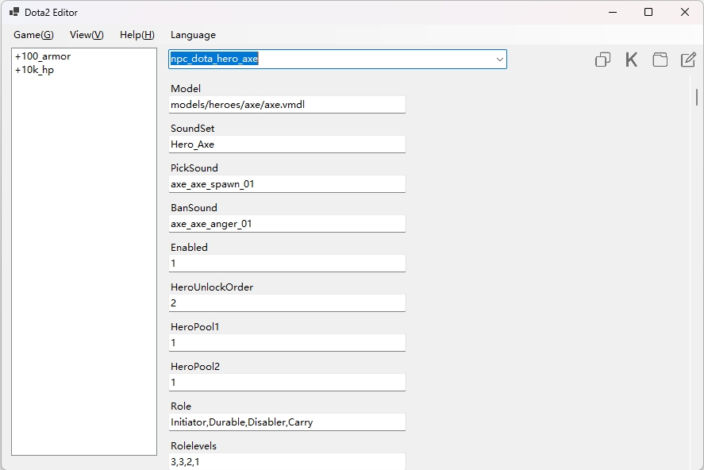
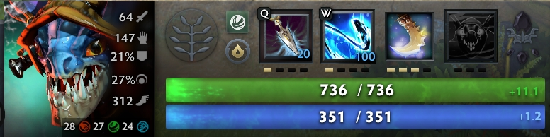

# Dota2Editor   

**[中文文档](#cn)**

This software lets you modify items, units, and heroes in the DOTA 2 game.

Please note that these modifications only work in **offline games against bots**. 

Additionally, if you encounter any issues, you can still use the software as a decompressor and compressor for VPK files. 

The decompressed data will be saved in <working_directory/data/stash/>.

We do not offer automatic updates, so please star this project and check back regularly for new releases!

## 0 Quick Start
1. Make sure your computer supports and has the [.NET 8 runtime](https://dotnet.microsoft.com/zh-cn/download/dotnet/8.0) installed.
2. Download the newest software from [Release Page](https://github.com/ado-cs/Dota2Editor/releases) and run it.
3. Set the game path by clicking the "Set Game Path" button in the "Game" menu. This will open a folder selection dialog where you can choose the Dota2 game directory.
4. Choose a view from the "View" menu.
5. Select a item from the drop-down box.
6. After modification, close the Dota2 game if it is running and click the "Save Changes" button in the "Game" menu to make these changes take effect in the game.

## 1 List of Records
This feature allows you to save the changes in the current view. 

Whenever you open this view, the previously saved changes will be displayed in the list box. 

You can reapply changes to the view by right-clicking on the target item(s) in the list box and selecting the Load button.

## 2 Open Local Folder
After selecting a view and clicking this button, the software will open Explorer and highlight the file (or the directory) corresponding to that view.

## 3 Batch Modification
Clicking this button will open a new dialog. 

This dialog allows you to quickly modify multiple properties in this view.

We allow fuzzy matching to locate names of the properties.
- The symbol * can substitute for zero or more characters
- The symbol ? can substitute for any single character.

For example, 

Key Pattern = "Attribute*Gain" matches: "AttributeStrengthGain", "AttributeIntelligenceGain", "AttributeAgilityGain"

## 4 Change Language
The software supports English and Chinese interfaces. If you want to add support for other languages, you can create a UTF-8 encoded text file following the format of [English.txt](https://github.com/ado-cs/Dota2Editor/blob/main/English.txt) and save it in the <working_directory/langs>.

# 中文文档
自定义修改Dota2游戏数据，包括物品属性、单位属性、单位技能、英雄属性、英雄技能等。

注意，修改只在 **对抗人机的离线自建游戏** 中生效。

如果你觉得此软件不好用, 你也可以把它当作 VPK 文件的解压器和压缩器。 

解压后的文件会被保存到 <工作目录/data/stash/>.

软件没有自动更新的功能, 请 Star 这个项目并定时到 releases 查看更新!

## 0 快速开始
1. 确保已安装 [.NET 8 运行时](https://dotnet.microsoft.com/zh-cn/download/dotnet/8.0)。
2. 从 [Release Page](https://github.com/ado-cs/Dota2Editor/releases) 下载最新程序并运行。
3. 点击 "游戏"-"选择游戏路径" 选择Dota2的游戏路径。
4. 从"视图"中选择一个视图。
5. 从下拉框中选择一个项目。
6. 修改完成后，确保Dota2游戏关闭，点击 "游戏"-"写出" 让修改在游戏中生效。

## 1 修改记录
你可以将当前视图的修改保存成记录。 

任何时候你打开这个视图，此前的记录都会展示在列表中。 

你可以通过右击列表中的记录并选择加载这些记录。

## 2 打开本地目录
在选择一项视图并点击这个按钮后, 软件会用资源管理器打开并选中该视图对应的文件（或目录）。

## 3 批量修改
点击这个按钮会打开一个新的对话框。 

这个对话框帮助你快速修改当前视图中的多项属性。

我们允许用模糊匹配来定位属性名.
- * 匹配0个或多个字符
- ? 匹配任意一个字符

例如, 

键的模式 = "Attribute*Gain" 匹配: "AttributeStrengthGain", "AttributeIntelligenceGain", "AttributeAgilityGain"

## 4 改变语言
这个软件支持英文和中文. 如果你想要支持其他语言, 你可以参照 [English](https://github.com/ado-cs/Dota2Editor/blob/main/English.txt) 创建一个 UTF-8 编码的文本文件并将它保存在 <工作目录/langs> 。
